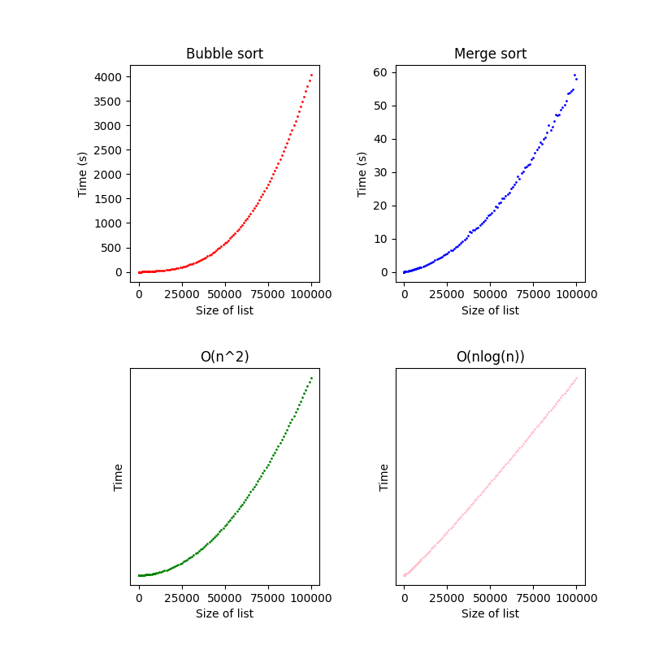

# Multithreaded-sort

An Java implementation of a **Bubble sort** and a **Merge sort**.

## Methodology
The **Bubble sort** is included as a reference and form of comparison. The main objective is the **Merge sort** which utilises Threads to simulate the distribution of tasks. 

## Time complexities

